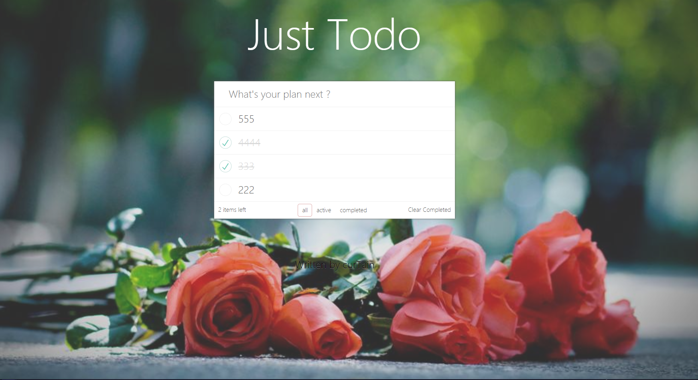

# 前言
    一切你觉得困难的东西并不可怕，
    只要你静下心去看文档，
    静下心去学习和实践，
    最终，你会成功的。

# just TODO
这是跟着慕课网Jokcy老师的课程：[Vue+Webpack打造todo应用](https://www.imooc.com/learn/935)的学习时的demo

## Demo预览
[Just Todo](https://curtaintan.github.io/webpack-vue-demo/dist/)

## 效果图：

## 版本说明：
- vue: 2.6.10
- webpack: 4.36.1
- webpack-dev-server: 3.7.2
